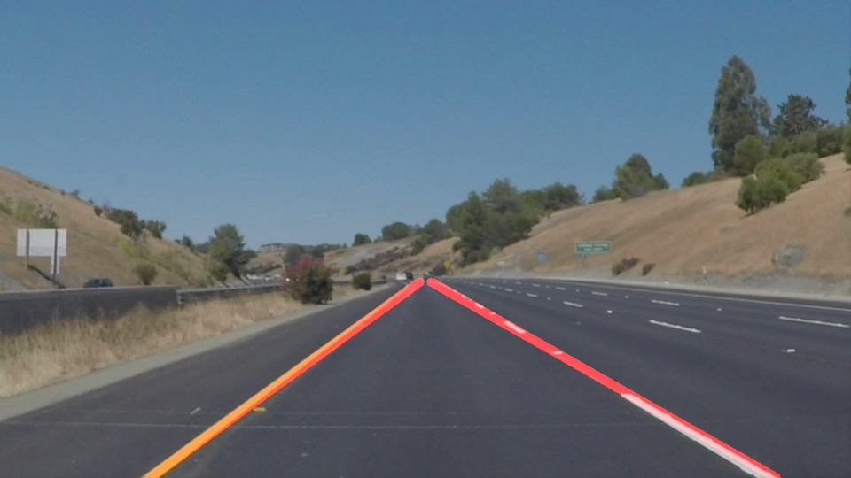
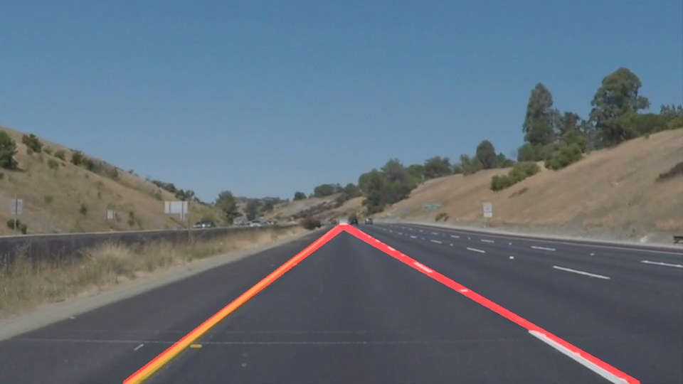

# **Finding Lane Lines on the Road** 

## Ren Silva

**Finding Lane Lines on the Road**

The goals / steps of this project are the following:
* Make a pipeline that finds lane lines on the road
* Reflect on your work in a written report

[//]: # (Image References)

[image1]: ./examples/grayscale.jpg "Grayscale"

---

### Reflection

### 1. Describe your pipeline. As part of the description, explain how you modified the draw_lines() function.

My pipeline consisted of 8 steps. 

1. Resized the images to a consistent size
2. Converted the images to grayscale
3. Calculated Canny filters using an auto-canny function
4. Applied a gaussian blur
5. Found the apex of the triangle on the canny-edged image
6. Isolated the area of interest (I ended up creating the function to isolate the area of interest)
7. Applied the Hough filter
8. Brought back lines to original picture size

In order to draw a single line on the left and right lanes, I modified the draw_lines() function by creating a new function that replaces all existing lines with two lanes. They are grouped based on slope. Then I replace all lanes, with the average slope of each group, starting at the apex of the triangle and finishing in the bottom border of the picture.

This is what I got in each test image:

### 2. Identify potential shortcomings with your current pipeline

One potential shortcoming of this model is that it is highly dependent of lighting conditions. Challenge 1 and 2 worked well with the trained model, but challenge 3 did not (in fact, I decided to leave challenge 3 for now, submitting the project without resolving it. I plan to go back to it later). 

Another shortcoming of this model is if the lanes had different or fading colours. I am always concerned of what happens in places where the lanes do not exist, may be f ading, or roadworks are taking place. This present approach simply does not seem to cut in those situations.

Another shortcoming is that, as the vehicle moves, the next video frame may not pick up the lanes as well as the video previous frame - and this will cause "flickering" lanes (i.e. lanes appearing in on frame, then disappearing in the next, as the vehicle moves)

### 3. Suggest possible improvements to your pipeline

A possible improvement would to average the lanes over a number of frames - this would make the lanes more consistent, and less flickering.

On the other hand, it would be possible to achieve better results, in less consistent conditions, by using a convolutional network-based model to find the lanes. By training the model in many different road and light conditions, we would be able to get a more consistent set of lanes. That would be more accurate and safer.

