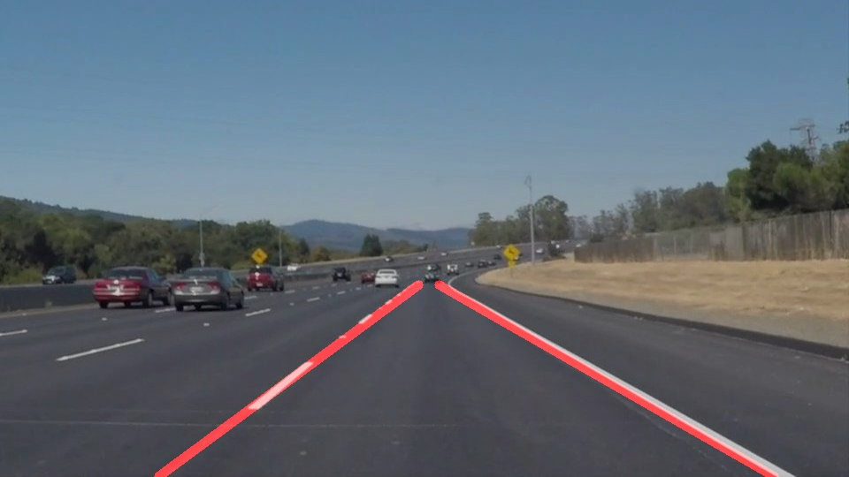
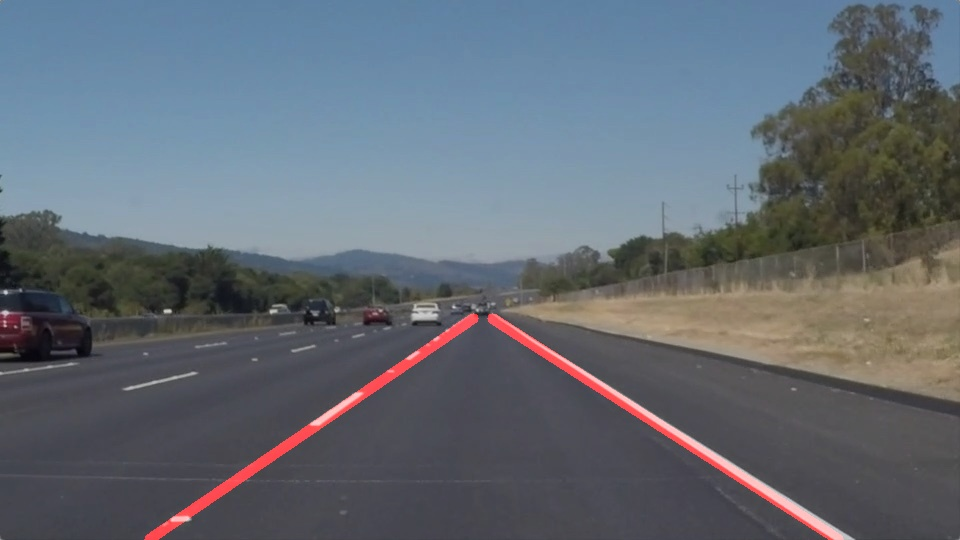

# **Finding Lane Lines on the Road** 

## Ren Silva

**Finding Lane Lines on the Road**

The goals / steps of this project are the following:
* Make a pipeline that finds lane lines on the road
* Reflect on your work in a written report

[//]: # (Image References)

[image1]: ./examples/grayscale.jpg "Grayscale"

---

### Reflection

### 1. Describe your pipeline. As part of the description, explain how you modified the draw_lines() function.

My pipeline consisted of 10 steps. 

1. Resized the images to a consistent size, 
2. Converted the images to grayscale, 
3. Calculated Canny filters using an auto-canny function, 
4. Applied a gaussian blur
5. Found the apex of the triangle on the canny-edged image
6. Isolated the area of interest (I ended up creating the function to isolate the area of interest)
7. Applied the Hough filter
8. Extended the lines to the edge of the picture

In order to draw a single line on the left and right lanes, I modified the draw_lines() function by ...

This is what I got in each test image:

### 2. Identify potential shortcomings with your current pipeline

One potential shortcoming would be what would happen the light conditions change. 

In effect, the light conditions changed only slightly in optional challenge 3 and I am finding it hard to resolve (I am still trying to resolve it, but in the name of expediency, I am submitting the project with challenges 1 and 2 only)

Another shortcoming if the lanes had different or fading colours. I am always concerned when happens in places where the lanes do not exist, are fading, or roadworks are taking place. This approach simply does not seem to cut in that situation.

Another shortcoming is that, as the vehicle moves, the next frame may not pick up the lanes as well as the previous frame - and this will cause "flickering" lanes (i.e. lanes appearing and disappearing as the vehicle moves)

### 3. Suggest possible improvements to your pipeline

A possible improvement would to average the lanes over a number of frames - this would make the lanes more consistent, and less movable.

It would be more laborious, but more accurate to use convolutional networks to find the lanes. By training the model in many different road and light conditions, we would be able to get a more consistent set of lanes. That would be more accurate and safer. 
